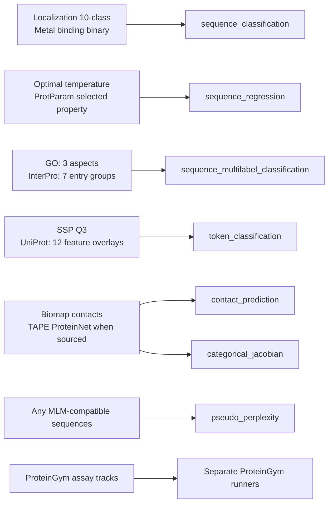

# Evaluation Dataset Catalog

This catalog explains what each evaluation dataset measures, what one target
represents, and which task consumes it. The overlay files beside this README
configure the standard `run_evaluate.py` pipeline. Counts below come from the
checked-in overlays; generated vocabularies can differ when source filters or
revisions change. For acquisition and artifact-generation details, see the
[dataset-sourcing guide](../../src/dataset_sourcing/README.md).

## Dataset-to-Task Map

Each label shape implies a different prediction target:

| Task | One target example |
|---|---|
| `sequence_classification` | One class ID per protein. |
| `sequence_multilabel_classification` | A fixed-width binary vector indicating which annotations apply to a protein. |
| `sequence_regression` | One numeric value per protein. |
| `token_classification` | One class ID per residue; special tokens and padding are not targets. |
| `contact_prediction` | Sparse positive residue pairs; other valid pairs at separation 6 or greater are implicit negatives. |
| `categorical_jacobian` | Zero-shot contact ranking from a masked-LM; evaluated against contact-pair labels. |
| `pseudo_perplexity` | No source labels; mask each residue and score its original amino-acid token. |

The diagram groups overlays by task. `pseudo_perplexity` can use any standard
sequence dataset when the model is a masked language model and its tokenizer
has a mask token. ProteinGym uses a separate assay-level workflow.

The task names are the `workspace.task_type` values. `categorical_jacobian` is
a zero-shot contact-ranking method evaluated against contact-pair labels; it is
not a trainable contact head. ProteinGym uses its own assay-level data contract
and runners rather than the standard task handlers.

## Standard Evaluation Overlays

### Biomap-Research

| Overlay | What the target means | Target size | Hub dataset | Task |
|---|---|---|---|---|
| [`localization_prediction`](localization_prediction.yaml) | One of 10 source-defined subcellular-localization labels; common examples of localization concepts include nucleus, cytosol, and extracellular space. | 10 classes | [swhitfield/biomap-research-localization_prediction](https://huggingface.co/datasets/swhitfield/biomap-research-localization_prediction) | `sequence_classification` |
| [`metal_ion_binding`](metal_ion_binding.yaml) | Binary target for whether the protein is annotated as binding a metal ion. | 2 classes | [swhitfield/biomap-research-metal_ion_binding](https://huggingface.co/datasets/swhitfield/biomap-research-metal_ion_binding) | `sequence_classification` |
| [`optimal_temperature`](optimal_temperature.yaml) | One numeric optimal-temperature target per protein. | 1 scalar | [swhitfield/biomap-research-optimal_temperature](https://huggingface.co/datasets/swhitfield/biomap-research-optimal_temperature) | `sequence_regression` |
| [`ssp_q3`](ssp_q3.yaml) | One source-defined three-state secondary-structure label per residue (helix, strand, and coil-like states are the usual Q3 concepts). | 3 classes | [swhitfield/biomap-research-ssp_q3](https://huggingface.co/datasets/swhitfield/biomap-research-ssp_q3) | `token_classification` |
| [`contact_prediction_binary`](contact_prediction_binary.yaml) | Sparse structural contact pairs. Valid residue pairs at sequence separation 6 or greater that are not listed as positive are treated as negatives. | Pair labels, not `num_labels` classes | [swhitfield/biomap-research-contact_prediction_binary](https://huggingface.co/datasets/swhitfield/biomap-research-contact_prediction_binary) | `contact_prediction`, `categorical_jacobian` |

### UniProt Gene Ontology

Each overlay predicts protein-level multi-hot UniProtKB annotations for one GO
aspect. The terms are annotation targets; an unannotated term is not necessarily
evidence that the protein lacks that function.

| Overlay | What the target means | Target size | Hub dataset | Task |
|---|---|---|---|---|
| [`GO_mf`](GO_mf.yaml) | UniProtKB molecular-function terms, such as activities involving binding or catalysis. | 1,225 labels | [swhitfield/uniprot-GO_mf](https://huggingface.co/datasets/swhitfield/uniprot-GO_mf) | `sequence_multilabel_classification` |
| [`GO_bp`](GO_bp.yaml) | UniProtKB biological-process terms, describing processes in which a protein participates. | 1,899 labels | [swhitfield/uniprot-GO_bp](https://huggingface.co/datasets/swhitfield/uniprot-GO_bp) | `sequence_multilabel_classification` |
| [`GO_cc`](GO_cc.yaml) | UniProtKB cellular-component terms, such as a location or macromolecular complex. | 557 labels | [swhitfield/uniprot-GO_cc](https://huggingface.co/datasets/swhitfield/uniprot-GO_cc) | `sequence_multilabel_classification` |

Each target is a multi-hot vector over the aspect's retained term vocabulary.
Term counts reflect the checked-in overlays; the source drops rare terms using
its configured minimum-count threshold. An unannotated term is not necessarily
evidence that the protein lacks that function.

### InterPro

Each overlay is a protein-level multi-hot prediction of InterPro entries from
one annotation group. A positive bit means that the protein is associated with
that entry; it does not locate the entry along the sequence. Example concepts
below are illustrative, not a promise that the exact entry is in the current
filtered vocabulary.

| Overlay | What an entry represents | Target size | Hub dataset | Task |
|---|---|---|---|---|
| [`interpro_active_site`](interpro_active_site.yaml) | Entries describing catalytic sites or residues involved in enzyme chemistry. | 84 labels | [swhitfield/interpro_active_site](https://huggingface.co/datasets/swhitfield/interpro_active_site) | `sequence_multilabel_classification` |
| [`interpro_binding_site`](interpro_binding_site.yaml) | Entries describing sites that bind a ligand, ion, cofactor, or other molecule. | 55 labels | [swhitfield/interpro_binding_site](https://huggingface.co/datasets/swhitfield/interpro_binding_site) | `sequence_multilabel_classification` |
| [`interpro_conserved_site`](interpro_conserved_site.yaml) | Conserved functional-site entries that are not classified as active or binding sites. | 477 labels | [swhitfield/interpro_conserved_site](https://huggingface.co/datasets/swhitfield/interpro_conserved_site) | `sequence_multilabel_classification` |
| [`interpro_domain`](interpro_domain.yaml) | Entries for recognizable protein domains, often with a structural or functional unit (for example, a kinase domain). | 7,426 labels | [swhitfield/interpro_domain](https://huggingface.co/datasets/swhitfield/interpro_domain) | `sequence_multilabel_classification` |
| [`interpro_family`](interpro_family.yaml) | Entries grouping related proteins into sequence families, such as a particular enzyme family. | 7,386 labels | [swhitfield/interpro_family](https://huggingface.co/datasets/swhitfield/interpro_family) | `sequence_multilabel_classification` |
| [`interpro_homologous_superfamily`](interpro_homologous_superfamily.yaml) | Broader entries linking proteins through evidence of remote common ancestry. | 1,515 labels | [swhitfield/interpro_homologous_superfamily](https://huggingface.co/datasets/swhitfield/interpro_homologous_superfamily) | `sequence_multilabel_classification` |
| [`interpro_repeat`](interpro_repeat.yaml) | Entries for repeated sequence or structural modules; representative examples include ankyrin, leucine-rich, and WD40-like repeats. | 150 labels | [swhitfield/interpro_repeat](https://huggingface.co/datasets/swhitfield/interpro_repeat) | `sequence_multilabel_classification` |

For all seven groups, the vector width is the configured label-vocabulary size.
Use the artifact's `label_vocabulary.json` to see the exact InterPro accessions
and names included in a particular release.

### UniProt Residue Annotations

These overlays predict per-residue UniProtKB feature annotations. They use
evidence-filtered annotations; on retained proteins, residues without a
selected feature are background labels, not experimentally verified absences.

| Overlay | What one residue label represents | Target size | Hub dataset | Task |
|---|---|---|---|---|
| [`uniprot_domains`](uniprot_domains.yaml) | Domain feature versus background. | 2 classes | [swhitfield/uniprot_domains](https://huggingface.co/datasets/swhitfield/uniprot_domains) | `token_classification` |
| [`uniprot_functional_sites`](uniprot_functional_sites.yaml) | Background, active site, binding site, or DNA-binding site. | 4 classes | [swhitfield/uniprot_functional_sites](https://huggingface.co/datasets/swhitfield/uniprot_functional_sites) | `token_classification` |
| [`uniprot_glycosylation`](uniprot_glycosylation.yaml) | Glycosylation feature versus background. | 2 classes | [swhitfield/uniprot_glycosylation](https://huggingface.co/datasets/swhitfield/uniprot_glycosylation) | `token_classification` |
| [`uniprot_lipidation`](uniprot_lipidation.yaml) | Lipidation annotation categories, taken from UniProt feature notes where available. | 18 classes | [swhitfield/uniprot_lipidation](https://huggingface.co/datasets/swhitfield/uniprot_lipidation) | `token_classification` |
| [`uniprot_membrane_pass`](uniprot_membrane_pass.yaml) | Background, transmembrane, or intramembrane region. | 3 classes | [swhitfield/uniprot_membrane_pass](https://huggingface.co/datasets/swhitfield/uniprot_membrane_pass) | `token_classification` |
| [`uniprot_peptide`](uniprot_peptide.yaml) | Background, propeptide, signal peptide, or transit peptide. | 4 classes | [swhitfield/uniprot_peptide](https://huggingface.co/datasets/swhitfield/uniprot_peptide) | `token_classification` |
| [`uniprot_phosphorylation`](uniprot_phosphorylation.yaml) | Phosphorylation-related modified-residue annotations, using note-specific labels. | 6 classes | [swhitfield/uniprot_phosphorylation](https://huggingface.co/datasets/swhitfield/uniprot_phosphorylation) | `token_classification` |
| [`uniprot_post_translational_modification`](uniprot_post_translational_modification.yaml) | Modified residues, lipidation, disulfide bonds, and glycosylation. | 5 classes | [swhitfield/uniprot_post_translational_modification](https://huggingface.co/datasets/swhitfield/uniprot_post_translational_modification) | `token_classification` |
| [`uniprot_regions`](uniprot_regions.yaml) | Annotated region versus background. | 2 classes | [swhitfield/uniprot_regions](https://huggingface.co/datasets/swhitfield/uniprot_regions) | `token_classification` |
| [`uniprot_secondary_structure`](uniprot_secondary_structure.yaml) | Background, helix, beta strand, or turn. | 4 classes | [swhitfield/uniprot_secondary_structure](https://huggingface.co/datasets/swhitfield/uniprot_secondary_structure) | `token_classification` |
| [`uniprot_structures`](uniprot_structures.yaml) | Background, repeat, coiled coil, or zinc finger. | 4 classes | [swhitfield/uniprot_structures](https://huggingface.co/datasets/swhitfield/uniprot_structures) | `token_classification` |
| [`uniprot_topology`](uniprot_topology.yaml) | Topological-domain categories, such as regions on different sides of a membrane. | 13 classes | [swhitfield/uniprot_topology](https://huggingface.co/datasets/swhitfield/uniprot_topology) | `token_classification` |

Counts are the configured `num_labels` and include background where applicable.
Overlapping annotations are marked ambiguous and ignored by the loss/metrics.
For note-derived groups, label names are data-dependent; inspect the generated
`label_vocabulary.json` for the exact categories. The source filters annotations
by evidence, so background means unannotated under the configured source query,
not verified absence.

### UniProt ProtParam

| Overlay | What the target means | Hub dataset | Task |
|---|---|---|---|
| [`uniprot_protparams`](uniprot_protparams.yaml) | Regress one of 31 selected numeric properties, such as amino-acid composition, molecular mass, or GRAVY. Set `steps.prepare.label_column`; this overlay defaults to `gravy`. | [swhitfield/uniprot_protparams](https://huggingface.co/datasets/swhitfield/uniprot_protparams) | `sequence_regression` |

The 31 properties are sequence-derived or reported by UniProt, not independent
experimental outcomes. This evaluation measures whether embeddings recover
those properties from sequence. See the sourcing guide for the property list
and feature definitions.

## Separate Dataset Workflows

These datasets do not have standard overlays in this directory.

| Dataset | What it measures | Workflow |
|---|---|---|
| TAPE ProteinNet | Structural contacts derived from residue coordinates; contact pairs are the positive labels. | Use the generated repository or local artifact with `contact_prediction` or `categorical_jacobian`. |
| ProteinGym DMS substitutions / indels | Per-assay variant-effect measurements for single/double substitutions or indels. | Dedicated zero-shot and supervised ProteinGym runners. |
| ProteinGym clinical substitutions / indels | Per-assay clinical labels for substitutions or indels. | Dedicated zero-shot and supervised ProteinGym runners. |

See the [ProteinGym evaluation section](../../README.md#proteingym-evaluation)
for scoring modes and the [dataset-sourcing guide](../../src/dataset_sourcing/README.md)
for dataset acquisition and artifact details.
